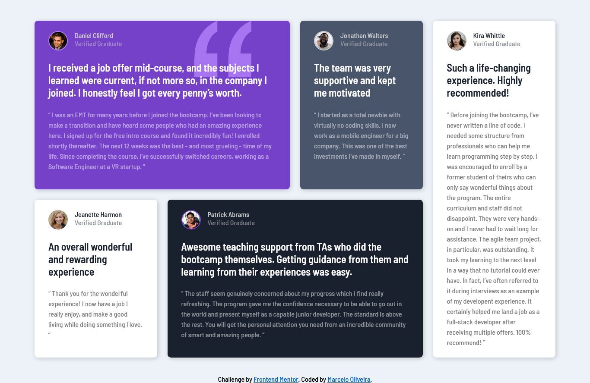

# Frontend Mentor - Testimonials grid section solution

This is a solution to the [Testimonials grid section challenge on Frontend Mentor](https://www.frontendmentor.io/challenges/testimonials-grid-section-Nnw6J7Un7). Frontend Mentor challenges help you improve your coding skills by building realistic projects.

## Table of contents

- [Overview](#overview)
  - [The challenge](#the-challenge)
  - [Screenshot](#screenshot)
  - [Links](#links)
- [My process](#my-process)
  - [Built with](#built-with)
  - [What I learned](#what-i-learned)
  - [Useful resources](#useful-resources)
- [Author](#author)

## Overview

### The challenge

Users should be able to:

- View the optimal layout for the site depending on their device's screen size

### Screenshot



### Links

- Solution URL: [Add solution URL here](https://your-solution-url.com)
- Live Site URL: [Add live site URL here](https://your-live-site-url.com)

## My process

### Built with

- Semantic HTML5 markup
- CSS custom properties
- Flexbox
- CSS Grid

### What I learned

- How to position containers individually with _CSS grid_ positioning

```css
main {
  display: grid;
  gap: 1.5rem;
  grid-template-columns: repeat(4, 1fr);
}

.daniel {
  grid-column: span 2;
  position: relative;
}

.kira {
  grid-column: 4;
  grid-row: 1 / span 2;
}

.patrick {
  grid-column: 2 / span 2;
  grid-row: 2;
}
```

- That elements need to be positioned for the _z-index_ property to work properly

```css
.daniel .username,
.daniel .user-status,
.daniel .testimonial-title {
  position: relative;
  z-index: 1;
}
```

### Useful resources

- [CSS grid Course](https://cssgrid.io/) - This helped me to better understand how to use _grid_ and how it actually works. I'd recommend it to anyone still learning this concept.
- [Z-index tutorial](https://www.w3schools.com/css/css_z-index.asp) - This is an amazing article which helped me better understand the _z-index_ property.

## Author

- Website - [Marcelo Oliveira](https://www.linkedin.com/in/marcelo-h-ferreira-de-oliveira/?originalSubdomain=br)
- Frontend Mentor - [@heiderick13](https://www.frontendmentor.io/profile/heiderick13)
